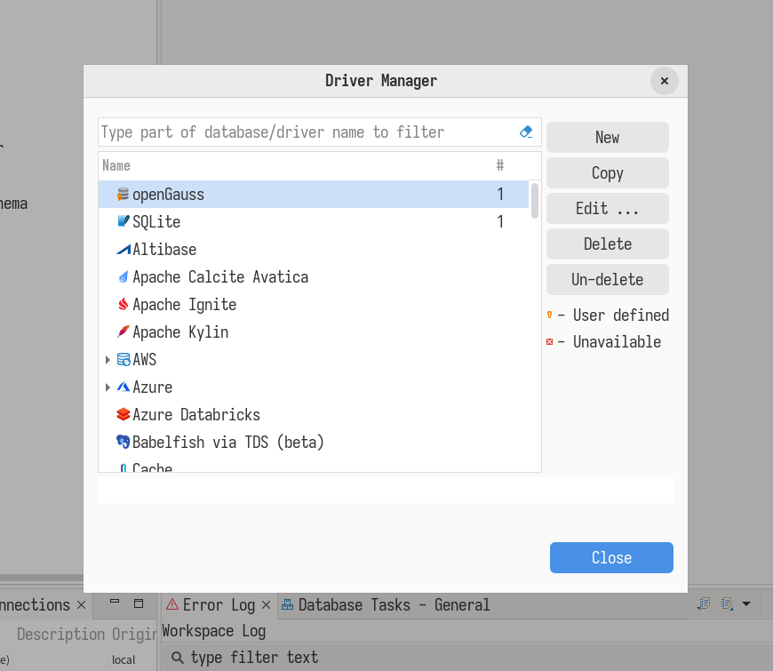
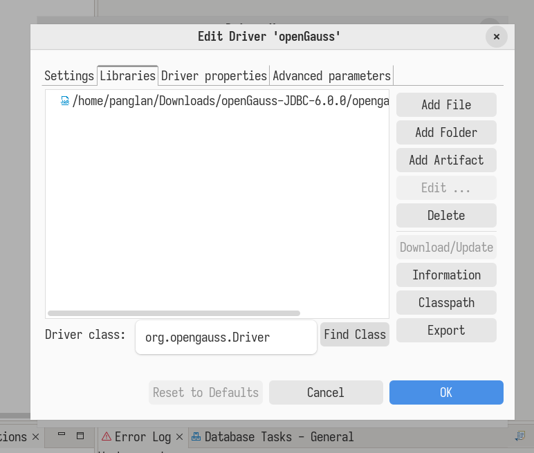
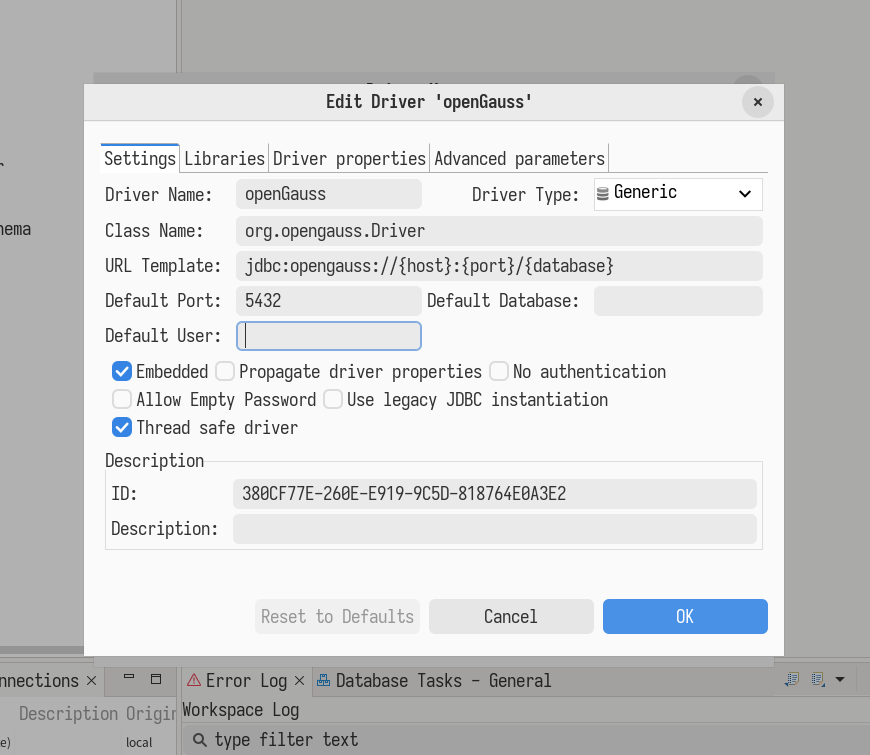
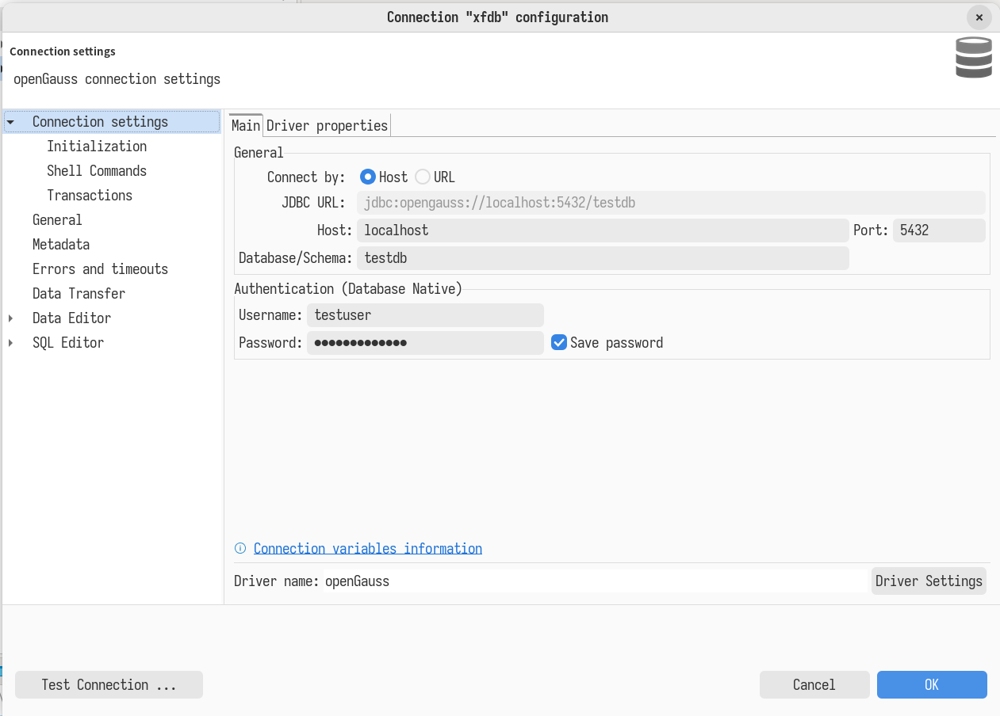
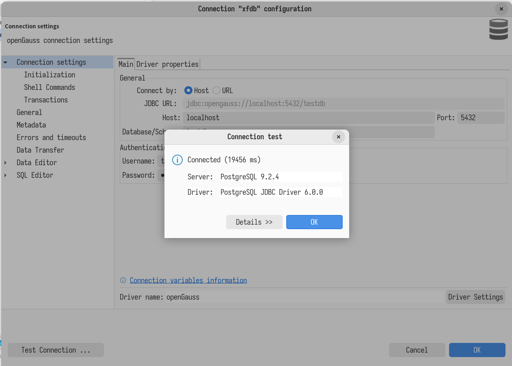
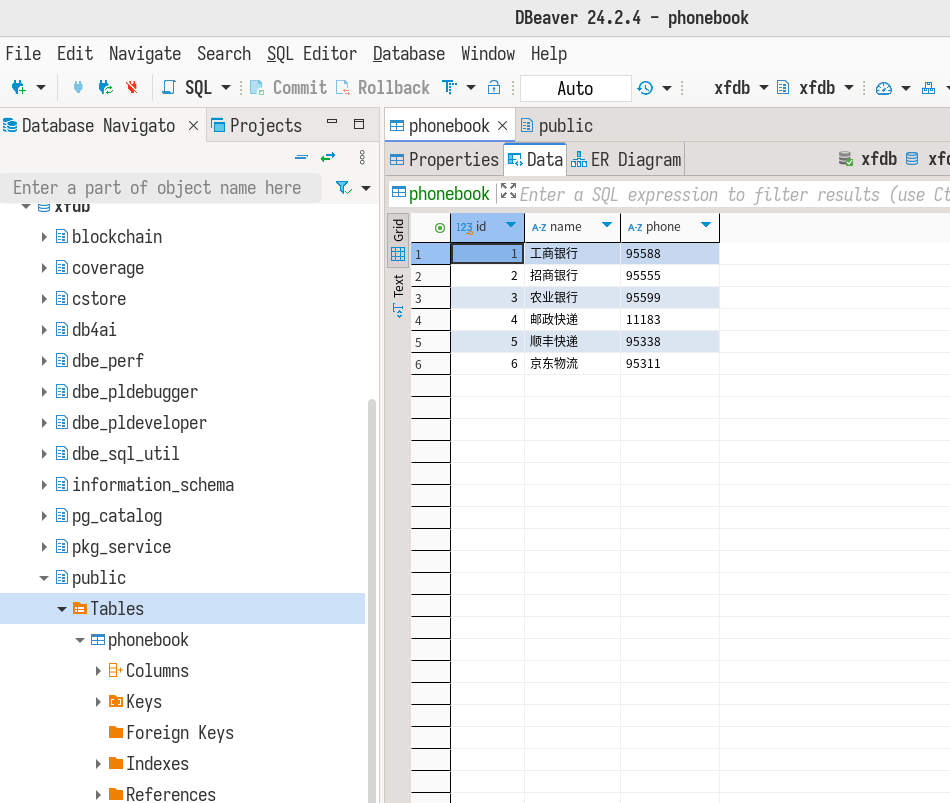

# 简介

## 软件说明
openGauss 是一个免费的开源关系型数据库管理系统，主要由华为开发和维护。它是一个广泛使用的代码库，为企业级应用提供了高性能、高可用性和高安全性的数据库解决方案。

## 测试目的
本次测试旨在验证 openGauss 在 RISC-V 平台上的可用性，特别是在 Milk-V Pioneer Box 和 Sipeed LicheePi 4A 两个典型平台上的表现。本报告通过手动测试的方法，从目前的平台兼容性及用户的日常使用体验两个角度评估了 openGauss 当前在 RISC-V 平台上的可用性，并给出了定性和定量的结论，为其未来进一步的优化和支持提供参考。

## 测试概述
在本次测试中，我们评估了 openGauss 数据库在 RISC-V 平台上的可靠性和性能表现，尤其是在 Milk-V Pioneer Box 和 Sipeed LicheePi 4A 这两个平台上。Milk-V Pioneer Box 具备较强的处理能力，可以成功安装和运行 openGauss 数据库，并支持本地和远程连接。
测试使用了 openEuler 24.03 LTS 系统并手动编译 openGauss 6.0.0 版本。在功能测试部分，我们首先通过 gsql 和 dbeaver 工具验证了基本的数据库操作，包括用户和数据库的创建、基本的表操作等。在性能测试中，我们使用 sysbench 工具进行了读写和只读性能测试。为了进行比较，也在 x86_64 平台上进行同样的测试。


## 测试总结
目前 openGauss 在 riscv 上仅支持使用 openEuler 系统进行编译与安装,licheepi 4a 因为性能不足而无法启动 openGauss 服务,
Pioneer Box 可以正常本地和远程连接与使用.

使用 sysbench 在 Pioneer Box 上性能测试结果如下：

SQL statistics

> rw: oltp 测试,包含读写 r:select 测试,仅读

| Platform               | read    | write  | other  | total   | transactions | transactions/s | queries | queries/s | ignored errors | reconnects |
|------------------------|---------|--------|--------|---------|--------------|----------------|---------|-----------|----------------|------------|
| SG2042 @ 10 Threads rw | 278796  | 79654  | 39828  | 398278  | 11913        | 331.56         | 398278  | 6631.51   | 1              | 0          |
| SG2042 @ 64 Threads rw | 952280  | 272041 | 136057 | 1360378 | 68009        | 1128.35        | 1360378 | 22750.22  | 11             | 0          |
| SG2042 @ 64 Threads r  | 1851630 | 0      | 0      | 1851630 | 1851630      | 30766.50       | 1851630 | 30766.50  | 0              | 0          |
| X86_64 @ 10 Threads rw | 584472  | 166989 | 83497  | 834958  | 41747        | 695.69         | 834958  | 13914.18  | 1              | 0          |

Latency

| Platform               | min   | avg   | max     | 95th percentile | sum        |
|------------------------|-------|-------|---------|-----------------|------------|
| SG2042 @ 10 Threads rw | 25.62 | 30.13 | 99.91   | 33.72           | 599938.70  |
| SG2042 @ 64 Threads rw | 38.63 | 56.49 | 421.75  | 70.55           | 3842023.49 |
| SG2042 @ 64 Threads rw | 1.12  | 2.06  | 353.15  | 3.30            | 3822093.08 |
| X86_64 @ 10 Threads rw | 5.23  | 14.37 | 1569.33 | 21.50           | 599913.47  |


Threads fairness

| Platform               | events avg | events stddev | execution time avg | execution time stddev |
|------------------------|------------|---------------|--------------------|-----------------------|
| SG2042 @ 10 Threads rw | 1991.3000  | 32.68         | 59.9939            | 0.01                  |
| SG2042 @ 64 Threads rw | 1062.6406  | 24.58         | 60.0316            | 0.03                  |
| SG2042 @ 64 Threads r  | 28931.7188 | 1217.10       | 59.7202            | 0.03                  |
| X86_64 @ 10 Threads rw | 4174.7000  | 12.74         | 59.9913            | 0.00                  |


# 环境说明

## 硬件环境
本次测试主要在 Milk-V Pioneer Box 和 Sipeed LicheePi 4A 上进行，机器硬件配置为：

Milk-V Pioneer Box:
- CPU: SG2042 64 Core C920@2.0GHz
- RAM: 4 channel 3200Hz 128GB DDR4 SODIMM (32GB * 4)
- SSD: PCIe 3.0 x 4 1TB
- GPU: AMD R5 230

Sipeed LicheePi 4A:
- CPU: TH1520, RISC-V 2.0G C910 x4
- RAM: 16 GB 64bit LPDDR4X-3733
- Storage: 128 GB eMMC

x86_64:
- OS: openEuler 23.09 x86_64
- CPU: Xeon Gold 5215L CPU @ 2.50GHz, 10*vCPU (Proxmox VE 8.0 虚拟化环境)
- RAM: 8 GiB

## 软件环境
本次测试涵盖的系统版本和 openGauss 版本如下：

[openEuler](https://www.openeuler.org/zh/download/?version=openEuler%2024.03%20LTS) 24.03 LTS

[openGauss](https://gitee.com/opengauss/riscv) 6.0.0

## 测试环境搭建

### 安装 openEuler

#### Sipeed LicheePi 4A

从 [官网](https://www.openeuler.org/zh/download/?version=openEuler%2024.03%20LTS) 下载镜像：

选择 `RISC-V - 嵌入式 - lpi4a`。

使用 `fastboot` 刷写镜像到板载 eMMC

由于 LPi4A 默认的 USB VID/PID 通常不在默认 udev 规则内，在 Linux 下烧写时可能需要在 `fastboot` 前添加 `sudo`。

按住板上的 **BOOT** 按键不放，然后插入 USB-C 线缆上电（线缆另一头接 PC），即可进入 USB 烧录模式。

在 Windows 下使用设备管理器查看，会出现 `USB download gadget` 设备。

在 Linux 下，使用 `lsusb` 查看设备，会显示以下设备：`ID 2345:7654 T-HEAD USB download gadget`。

使用如下指令刷写镜像。

```shell
fastboot flash ram u-boot-with-spl-lpi4a-16g.bin
fastboot reboot
# 稍等几秒，等待开发板重启后重新连接至电脑
fastboot flash uboot u-boot-with-spl-lpi4a-16g.bin
fastboot flash boot openEuler-24.03-LTS-riscv64-lpi4a-base-boot.ext4
fastboot flash root openEuler-24.03-LTS-riscv64-lpi4a-base-root.ext4
```

#### Milk-V Pioneer Box

下载[系统镜像](https://mirrors.hust.edu.cn/openeuler/openEuler-24.03-LTS/embedded_img/riscv64/SG2042/openEuler-24.03-LTS-riscv64-sg2042.img.zip)，解压，使用 `dd` 烧录至 NVMe 硬盘。
下载[固件](https://mirrors.hust.edu.cn/openeuler/openEuler-24.03-LTS/embedded_img/riscv64/SG2042/sg2042_firmware_linuxboot.img.zip)，解压，使用 `dd` 烧录至 microSD 卡。

请将下面的 `/dev/sda` `/dev/sdb` 替换成实际使用的硬盘和存储卡位置。

```shell!
unzip openEuler-24.03-LTS-riscv64-sg2042.img.zip
sudo wipefs -af /dev/sda
sudo dd if=openEuler-24.03-LTS-riscv64-sg2042.img of=/dev/sda bs=1M status=progress
sudo eject /dev/sda
unzip sg2042_firmware_linuxboot.img.zip
sudo dd if=sg2042_firmware_linuxboot.img of=/dev/sdb bs=1M status=progress
```
将存储卡和硬盘插入系统上电开机。

### 安装 openGauss 数据库

因为[官网提供的下载中](https://opengauss.org/zh/download/)没有 riscv 架构的，所以需要手动构建并安装 opengauss 数据库

此文档针对 riscv 平台编写，在其他平台下使用请自行配置 qemu

#### 编译

使用 openEuler 容器编译可参考 https://github.com/QA-Team-lo/dbtest/blob/main/opengauss/install.md

以下使用 Pioneer Box 裸机编译:

下载源码

```bash
su 
mkdir /root/rpmbuild
cd /root/rpmbuild
git clone https://gitee.com/opengauss/riscv SOURCES
cd SOURCES
```

配置编译环境

```bash
# 安装必要工具
dnf install -y rpm-build rpmdevtools dnf-plugins-core
# 安装编译依赖
yum-builddep -y opengauss-server.spec
# 下载源码
spectool -g opengauss-server.spec
```

编译 rpm 包

```bash
rpmbuild -ba opengauss-server.spec
```

#### 安装
等待一段时间，编译完成后，安装

```bash
cd ../RPMS/riscv64/
dnf install -y opengauss-server-6.0.0-1.riscv64.rpm
```

#### 初始化 & 启动

```bash
systemctl enable --now opengauss-server
```

### 功能测试

在 PostgreSQL 中创建数据库和用户：
```bash
# 切换至 opengauss 用户
su opengauss

# 连接数据库
gsql -d postgres
```

当 gsql 连接数据库成功后，在 gsql 交互界面中输入
```sql
alter role "opengauss" password "openGauss@2024"; -- 修改默认用户密码

CREATE USER testuser WITH PASSWORD 'openEuler12#$'; -- 创建用户

CREATE DATABASE testdb owner testuser; -- 创建数据库
```


修改 opengauss 配置文件
```bash
vim /var/lib/opengauss/data/postgresql.conf
# 配置 listen_addresses = '*'
# 配置 password_encryption_type = 1

vim /var/lib/opengauss/data/pg_hba.conf
# 末尾增加: 
# host     all          testuser           0.0.0.0/0               md5

gs_ctl -D $HOME/data reload
# reload 后即可生效
```

### 性能测试

安装 sysbench
```bash
sudo dnf install sysbench
```

修改 opengauss 配置文件
```bash
vim /var/lib/opengauss/data/postgresql.conf
# 配置 listen_addresses = '*'
# 配置 password_encryption_type = 1

gs_ctl -D $HOME/data reload
# reload 后即可生效
```

在 openGauss 中创建数据库和用户(在修改密码规则后必须新建用户或修改密码才能使用)
```bash
su - opengauss

gsql -d postgres

CREATE USER testuser WITH PASSWORD 'openEuler12#$';

CREATE DATABASE testdb owner testuser;
```

授予权限用于测试
```log
[opengauss@openeuler-riscv64 openeuler]$ gsql -d postgres
gsql ((openGauss-lite 6.0.0 build ) compiled at 2024-11-22 20:54:23 commit 0 last mr  release)
Non-SSL connection (SSL connection is recommended when requiring high-security)
Type "help" for help.

openGauss=# GRANT ALL ON SCHEMA public TO testuser;
GRANT
openGauss=# GRANT ALL PRIVILEGES TO testuser; 
ALTER ROLE
```


# 测试内容

## 手动测试

### 本地测试
使用 `gsql -U testuser -d testdb` 连接数据库，创建表，并作简单的增删查操作
```sql
create table phonebook (
    id serial primary key,
    name varchar(20),
    phone varchar(20)
);

insert into phonebook (name, phone) values ('工商银行', '95588');
insert into phonebook (name, phone) values ('招商银行', '95555');
insert into phonebook (name, phone) values ('农业银行', '95599');

insert into phonebook (name, phone) values ('邮政快递', '11183');
insert into phonebook (name, phone) values ('顺丰快递', '95338');
insert into phonebook (name, phone) values ('京东物流', '95311');

select * from phonebook where name like '%银行';
select count(*) from phonebook;
delete from phonebook where name = '农业银行';
select * from phonebook;
```

#### 远程连接测试

### 远程测试

下载 [JDBC_6.0.0](https://opengauss.org/zh/download/) 数据库驱动并解压

启动 Dbeaver,并选择菜单->数据库->驱动管理器，在弹出对话框中，选择新建



填写新建驱动名称->选择 JDBC 驱动文件,添加解压出来的`opengauss-jdbc-6.0.0.jar`->选择 JDBC Driver 类



填写 URL 模板，值为:`jdbc:opengauss://{host}:{port}/{database}`,勾选嵌入，其他复选框不选择，然后确认，添加驱动即完成



选择菜单->数据库->新建连接，在弹出的框中搜索上一步中新建的 JDBC 驱动名,选择后点击下一步,如下图示



在弹出框中填写 openGauss 主机地址、端口、将要连接的数据库以及认证用户名和密码，点击测试链接验证是否可正确连接




## 性能测试

初始化数据库
```bash
sysbench --db-driver=pgsql --oltp-table-size=100000 --oltp-tables-count=24 --threads=1 --pgsql-host=127.0.0.1 --pgsql-port=5432 --pgsql-user=testuser --pgsql-password=openEuler12#$ --pgsql-db=testdb  /usr/share/sysbench/tests/include/oltp_legacy/parallel_prepare.lua run
```

使用下列命令验证生成的数据
```log
[opengauss@openeuler-riscv64 openeuler]$ gsql -U testuser -d testdb
Password for user testuser: 
gsql ((openGauss-lite 6.0.0 build ) compiled at 2024-11-22 20:54:23 commit 0 last mr  release)
Non-SSL connection (SSL connection is recommended when requiring high-security)
Type "help" for help.

testdb=> \dt
                            List of relations
 Schema |   Name   | Type  |  Owner   |             Storage              
--------+----------+-------+----------+----------------------------------
 public | sbtest1  | table | testuser | {orientation=row,compression=no}
 public | sbtest10 | table | testuser | {orientation=row,compression=no}
 public | sbtest11 | table | testuser | {orientation=row,compression=no}
 public | sbtest12 | table | testuser | {orientation=row,compression=no}
 public | sbtest13 | table | testuser | {orientation=row,compression=no}
 public | sbtest14 | table | testuser | {orientation=row,compression=no}
 public | sbtest15 | table | testuser | {orientation=row,compression=no}
 public | sbtest16 | table | testuser | {orientation=row,compression=no}
 public | sbtest17 | table | testuser | {orientation=row,compression=no}
 public | sbtest18 | table | testuser | {orientation=row,compression=no}
 public | sbtest19 | table | testuser | {orientation=row,compression=no}
 public | sbtest2  | table | testuser | {orientation=row,compression=no}
 public | sbtest20 | table | testuser | {orientation=row,compression=no}
 public | sbtest21 | table | testuser | {orientation=row,compression=no}
 public | sbtest22 | table | testuser | {orientation=row,compression=no}
 public | sbtest23 | table | testuser | {orientation=row,compression=no}
 public | sbtest24 | table | testuser | {orientation=row,compression=no}
 public | sbtest3  | table | testuser | {orientation=row,compression=no}
 public | sbtest4  | table | testuser | {orientation=row,compression=no}
 public | sbtest5  | table | testuser | {orientation=row,compression=no}
 public | sbtest6  | table | testuser | {orientation=row,compression=no}
 public | sbtest7  | table | testuser | {orientation=row,compression=no}
 public | sbtest8  | table | testuser | {orientation=row,compression=no}
 public | sbtest9  | table | testuser | {orientation=row,compression=no}
(24 rows)

testdb=> \d sbtest1
                             Table "public.sbtest1"
 Column |      Type      |                      Modifiers                       
--------+----------------+------------------------------------------------------
 id     | integer        | not null default nextval('sbtest1_id_seq'::regclass)
 k      | integer        | not null default 0
 c      | character(120) | not null default NULL::bpchar
 pad    | character(60)  | not null default NULL::bpchar
Indexes:
    "sbtest1_pkey" PRIMARY KEY, btree (id) TABLESPACE pg_default
    "k_1" btree (k) TABLESPACE pg_default

testdb=> \q
```


执行读/写测试
```bash
sysbench --db-driver=pgsql --report-interval=2 --oltp-table-size=100000 --oltp-tables-count=24 --threads=64 --time=60 --pgsql-host=127.0.0.1 --pgsql-port=5432 --pgsql-user=testuser --pgsql-password=openEuler12#$ --pgsql-db=testdb /usr/share/sysbench/tests/include/oltp_legacy/oltp.lua run
```
上述命令将从名为 /usr/share/sysbench/tests/include/oltp_legacy/oltp.lua 的 LUA 脚本生成 OLTP 工作负载，针对主服务器上 24 个表的 100,000 行（具有 64 个工作线程）持续 60 秒）。每 2 秒，sysbench 将报告中间统计信息（–report-interval=2）。

执行只读测试
```bash
sysbench --db-driver=pgsql --report-interval=2 --oltp-table-size=100000 --oltp-tables-count=24 --threads=64 --time=60 --pgsql-host=127.0.0.1 --pgsql-port=5432 --pgsql-user=testuser --pgsql-password=openEuler12#$ --pgsql-db=testdb /usr/share/sysbench/tests/include/oltp_legacy/select.lua run
```

清理测试数据
```bash
sysbench --db-driver=pgsql --report-interval=2 --oltp-table-size=100000 --oltp-tables-count=24 --threads=64 --time=60 --pgsql-host=127.0.0.1 --pgsql-port=5432 --pgsql-user=testuser --pgsql-password=openEuler12#$ --pgsql-db=testdb /usr/share/sysbench/tests/include/oltp_legacy/select.lua cleanup
```


# 测试结果


## 功能测试
licheepi 4a 由于性能较弱,在启动 openGauss 服务时超时,而 Pioneer Box 可以正常进行本地和远程连接


使用 dbeaver 远程连接 openGauss 数据库结果如图所示:



## 性能测试

详细结果参见 [logs](https://github.com/QA-Team-lo/dbtest/tree/main/opengauss/logs) 目录或附录。

性能对比

SQL statistics

> rw: oltp 测试,包含读写 r:select 测试,仅读

| Platform               | read    | write  | other  | total   | transactions | transactions/s | queries | queries/s | ignored errors | reconnects |
|------------------------|---------|--------|--------|---------|--------------|----------------|---------|-----------|----------------|------------|
| SG2042 @ 10 Threads rw | 278796  | 79654  | 39828  | 398278  | 11913        | 331.56         | 398278  | 6631.51   | 1              | 0          |
| SG2042 @ 64 Threads rw | 952280  | 272041 | 136057 | 1360378 | 68009        | 1128.35        | 1360378 | 22750.22  | 11             | 0          |
| SG2042 @ 64 Threads r  | 1851630 | 0      | 0      | 1851630 | 1851630      | 30766.50       | 1851630 | 30766.50  | 0              | 0          |
| X86_64 @ 10 Threads rw | 584472  | 166989 | 83497  | 834958  | 41747        | 695.69         | 834958  | 13914.18  | 1              | 0          |

Latency

| Platform               | min   | avg   | max     | 95th percentile | sum        |
|------------------------|-------|-------|---------|-----------------|------------|
| SG2042 @ 10 Threads rw | 25.62 | 30.13 | 99.91   | 33.72           | 599938.70  |
| SG2042 @ 64 Threads rw | 38.63 | 56.49 | 421.75  | 70.55           | 3842023.49 |
| SG2042 @ 64 Threads rw | 1.12  | 2.06  | 353.15  | 3.30            | 3822093.08 |
| X86_64 @ 10 Threads rw | 5.23  | 14.37 | 1569.33 | 21.50           | 599913.47  |


Threads fairness

| Platform               | events avg | events stddev | execution time avg | execution time stddev |
|------------------------|------------|---------------|--------------------|-----------------------|
| SG2042 @ 10 Threads rw | 1991.3000  | 32.68         | 59.9939            | 0.01                  |
| SG2042 @ 64 Threads rw | 1062.6406  | 24.58         | 60.0316            | 0.03                  |
| SG2042 @ 64 Threads r  | 28931.7188 | 1217.10       | 59.7202            | 0.03                  |
| X86_64 @ 10 Threads rw | 4174.7000  | 12.74         | 59.9913            | 0.00                  |

### 已知问题

时间所限，笔者暂时没有找到合适的测试机，文中所使用的 Openeuler X86_64 机器运行在 Hdd 上，I/O 性能会有严重瓶颈。这可能会影响 Tidb 的性能表现。

x86_64 机器运行在 PVE 虚拟化环境下。通常来说，KVM 虚拟化会有性能损失，但不会很大。这也可能会影响性能表现。

此外，内存大小不同也可能影响性能。

# 总结

本次测试确认了 openGauss 在 RISC-V 平台上的初步可用性。在 Milk-V Pioneer Box 上，openGauss 能够稳定运行并提供良好的用户体验，而在性能更低的 Sipeed LicheePi 4A 上，由于硬件的限制，无法顺利启动服务。
性能测试结果显示，在多线程操作下，Milk-V Pioneer Box 的性能与 x86_64 平台相比仍有差距。具体来说，在读写混合负载下，x86_64 平台的事务和查询处理能力明显高于 Pioneer Box。


